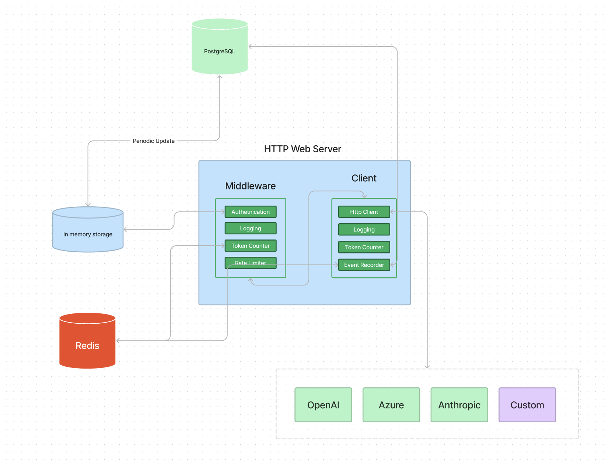
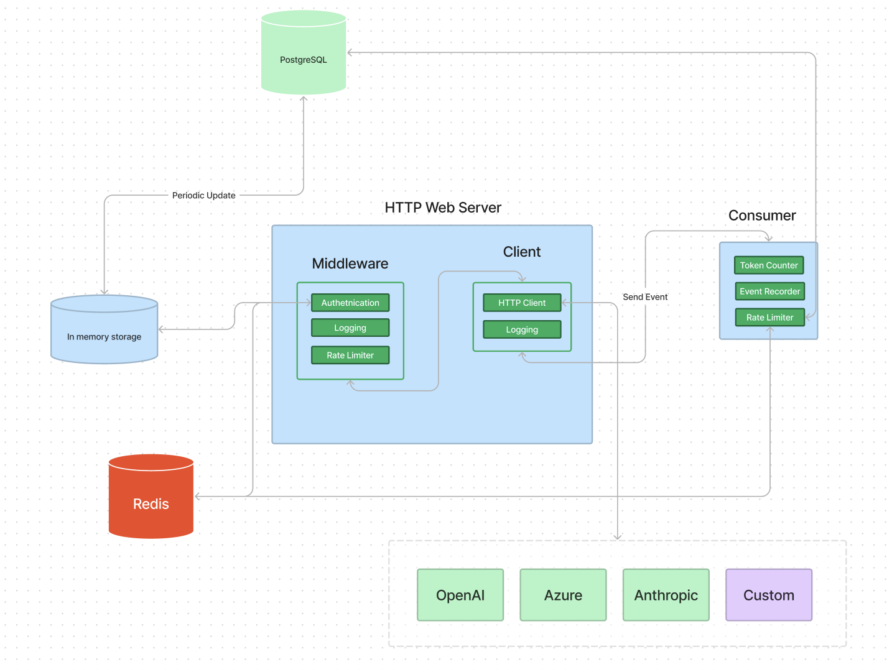

# How we created a highly scalable LLM gateway with go

When I was working at Unity Technologies, one of the most useful internal tools we built was an API gateway. It served as the authentication layer that connects the Unity dashboard to various microservices. In addition to authentication, the gateway also included a portal for API documentation built on top of swagger UI. 

Fast forward to 8 months ago, I realized that there was no demand [design to code plugin](https://www.figma.com/community/plugin/1178847414663679049/bricks-ai-powered-design-to-tailwindcss-code) that we had been working on for the past year. That was when we decided to pivot. When building the design to code plugin, we used GPT-4 to name all the variables in generated code to make it feel like it was written by a real developer. At the time, OpenAI did not provide any API key level usage metrics nor have features that could impose any restrictions regarding API key usage. That was when we started hearing horror stories regarding people losing thousands of dollars from stolen API keys. This along with my experience working with the API gateway at Unity became the greatest inspiration for [BricksLLM](https://github.com/bricks-cloud/bricksllm).

We wanted to create an API gateway specifically created for LLMs. When it came to technology choices, Go was a no-brainer due to its performance, type safety and emphasis on error handling. The first feature [we built](https://github.com/bricks-cloud/BricksLLM/blob/main/cookbook/granular_access_control.md) we developed was a way for developers to ratelimit OpenAI spending via API keys thus making these keys safer to use. 

Initially, we didn’t intend on building a very fast LLM gateway, because high performing LLMs such as GPT-4 did not have a very fast response time. On average, the GPT-4 API took about 60 seconds to respond to a fairly large prompt, meaning that a 1 second did not contribute much to the overall latency. This was a far cry from the advertisement bidding API that requires sub 1s latency that I used to work on at Unity. At the beginning, this was what BricksLLM’s architecture looked like:

<p align="center">

</p>

Due to insufficient testing, we didn’t realize that BricksLLM’s latency increased significantly as the length of prompts and responses increased. It wasn’t until one of our prospects demanded a sub 100ms latency that we discovered the performance issue with our gateway. From our investigation, most of our latency came from token counting. 

OpenAI maintains a python library called a BPE tokenizer called [tiktoken](https://github.com/openai/tiktoken). Since BricksLLM is written in Go, we opted to use a Go port of tiktoken. [go-tiktoken](https://github.com/pkoukk/tiktoken-go) is used by BricksLLM to calculate the number of tokens in OpenAI chat completion and embedding APIs. Our latency came from the inefficient use of go-tiktoken. When users use BricksLLM for OpenAI chat completion in streaming mode, we tried to initialize the core BPE for go-tiktoken for each streaming chunk that we received. Each initialization took about 83ms. This means that if we received 100 streaming chunks from the chat completion API, BricksLLM would add 8.3 seconds of latency. An obvious solution was to initialize the core BPE only once. This simple change removed the bulk of our latency. 

On this quest to improve the performance of BricksLLM, I was curious to find out how far we can push utilizing the power of Go. 

For each OpenAI chat completion request that goes through BricksLLM, we retrieve cached usage information (number of requests/cost incurred) from Redis to determine whether the request should be rate limited according to the corresponding API key configuration. The latency incurred here is about 30ms. This part can not be made async since the rate limit iss a feature that needs to happen before the request is forwarded to OpenAI. 

After receiving a response back from OpenAI, we generate an event enriched with latency, token usage and cost information to the DB. This operation creates about 50 ms of latency and can be made asynchronous. Thus, we updated the architecture of BricksLLM to make this operation asynchronous:

<p align="center">

</p>

Adopting an event driven architecture, events created by http requests are sent to the event bus storing the events within a channel. Eac consumer, in a different Go routine, handles counting the number of tokens of streaming responses, decorating the event with token usage information and ingesting the event into our DB. Utilizing the new architecture, we have successfully reduced the latency to about 30ms.

I wondered how the performance of our LLM gateway stacked up against similar OSS projects. As a result, I ran a series of tests using the load testing library [vegeta](https://github.com/tsenart/vegeta) firing the same prompt at different rates over 5s to see the performance limits of these softwares. The test was conducted on a 16GB MacBook Pro with M1 chip.

This was the prompt being used for calling the OpenAI chat completion proxy. 

```json
{ 
    "model": "gpt-3.5-turbo",
    "messages": [
        { 
            "role": "system", 
            "content": "hi" 
        } 
    ]
}
```

Here is the performance summary of BricksLLM. 

> | Rate | mean | median | Success rate |
> |---------------|-----------------------------------|----------|-|
> |20 req/s|576.755 ms|538.482 ms| 100%
> |50 req/s|610.418 ms|459.521 ms| 100%
> |100 req/s|551.477 ms|413.455 ms| 100%
> |500 req/s|521.155 ms|409.969 ms| 100%
> |1000 req/s|514.053 ms|413.161 ms| 100%
*Latency includes OpenAI response time

The other two LLM gateway I tested were [Helicone](https://www.helicone.ai/) and [LiteLLM](https://github.com/BerriAI/litellm). Both of these two softwares offer authentication and cost tracking very similar to BricksLLM.

Here is the performance summary of Helicone.

> | Rate | Mean | Median | Success rate |
> |---------------|-----------------------------------|----------|-|
> |20 req/s|419.755 ms|372.652 ms| 100%
> |50 req/s|514.753 ms|406.922 ms| 100%
> |100 req/s|477.845 ms|373.775 ms| 100%
> |500 req/s|1.019 s|894.994 ms| 100%
> |1000 req/s|18.839 s|19.971 s| 50%

Here is the performance summary of LiteLLM.
> | Rate | Mean | Median | Success rate |
> |---------------|-----------------------------------|----------|-|
> |20 req/s|486.674 ms|390.939 ms| 100%
> |50 req/s|524.655 ms|413.011 ms| 100%
> |100 req/s|514.139 ms|419.389 ms| 100%
> |500 req/s|13.769 s|14.331 ms| 92%
> |1000 req/s|13.346 s|10.164 s| 50%

*At 1000 req/s, LiteLLM returns a 429 error code 13% of the time.

Compared to Helicone and LiteLLM, BricksLLM did not experience performance degradation when req/s exceeds 500 req/s which greatly exceeded my expectation of its performance. Both Helicone and LiteLLM use Python which gives it a performance disadvantage since Python can only run on a single CPU core at a time. 

While it is unlikely that a LLM application would reach 1000 req/s and require a sub 100ms latency from a proxy, it is still pretty amazing to see how well Go’s compute efficiency reigns supreme in building high performing applications. 

Feel free to give [BricksLLM](https://github.com/bricks-cloud/bricksllm) a try and let us know what you think.